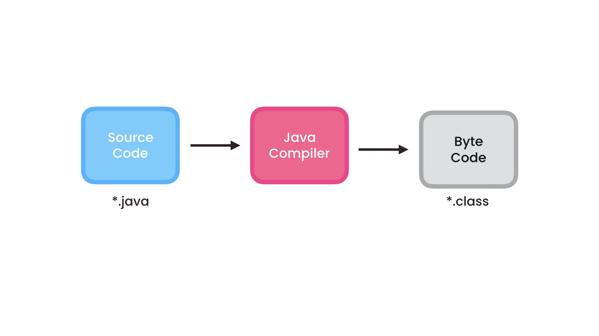
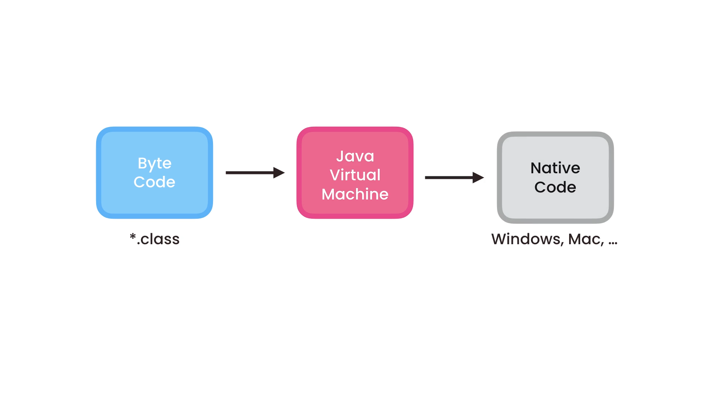

# Getting Started

## Table Of Content

- [Anatomy of Java](#anatomy-of-java)
- [How Java Code Gets Executed](#how-java-code-gets-executed)

## Anatomy of Java

Every java is build from blocks of functions contained by a class that must have the same name of the file, we call those functions by methods, a `method` is a function exists inside a class.
For the main class it should have the same name of the file as mentioned before, and have also a `main` method which is the entry point of our program

| As Convention we use in class naming Pascal Case, and Camel Case for methods <br>

Example of **Main.java**
<br>

```java
public class Main{
    public void main(String[] args) {

    }
}
```

## How Java Code Gets Executed






- we use package to group related classes

- we originze classes into packages

> As convention, in java the base package should be your domain in reverse
