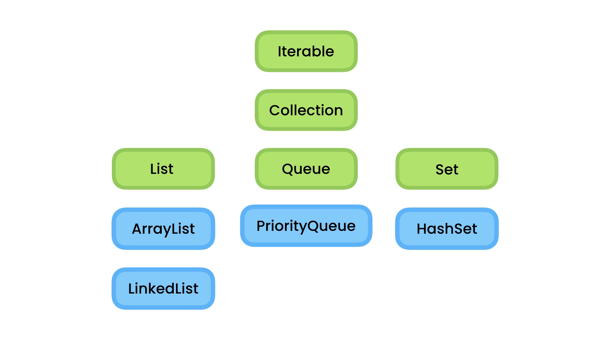

# Collections


## Overview: 



## The Need For Iterables:
When creating a class that we need to iterate over it, we can't do that by a loop, or we should change the list modifier inside the class to public, and use it directly which make our application more dependent to that class; if we want to change the list type our application is gonna break, because it accessing that list directly, but if that class uses Iterables interface we can loop over it.

## The Iterable Interface:

The Iterable Interface have 3 methods, 2 default methods, and one required method which `iterator()`.
> You can check the documentation for more informations
**Example**:

```java
public class className<T> implements Iterable<T>{
    //Instructions
    @Override
    public Iterator<T> iterator(){
        //...
    }
}
```
## The Iterator Interface:

The Iterator Interface having 4 methods(check documentation), two methods are required which are `hasNext()` & `next()`.

**Example**:
```java
// GenericList.java
package com.app.generics;

import java.util.Iterator;

public class GenericList<T> implements Iterable<T>  {

    @SuppressWarnings("unchecked")
    private T[] items = (T[]) new Object[10];

    private int count;

    public void add(T element) {
        items[count++] = element;
    }

    public T get(int index) {
        return items[index];
    }

    @Override
    public Iterator<T> iterator() {
        return new ListIterator(this);

    }

    private class ListIterator implements Iterator<T>{
        private GenericList<T> list;
        private int index;

        public ListIterator(GenericList<T> list){
            this.list = list;

        }

        @Override
        public boolean hasNext() {
            return (index < list.count);
        }

        @Override
        public T next() {
            return list.items[index++];
        }

        
    }

}
```


```java
//Main.java

package com.app;

import com.app.generics.GenericList;

public class Main {
    public static void main(String[] args) {
        var list = new GenericList<String>();
        list.add("one");
        list.add("one");
        list.add("one");
        list.add("one");
        list.add("one");
        list.add("one");
        list.add("one");
        list.add("one");
        
        System.out.println("line 17");
        for (var current : list) {

            System.out.println("line 20");
            System.out.println(current);
        }
        
        System.out.println("line 21");

    }
}
```
## The Collections Interface:

> Collections doesn't support indexing.
**Example**:

```java
package com.app.collections;

import java.util.ArrayList;
import java.util.Collection;
import java.util.Collections;

public class CollectionsDemo {
    
    public static void show(){
        Collection<String> collections = new ArrayList<>();
        //collections.add("a");
        Collections.addAll(collections, "a","b","c","d"); 
        collections.remove("a");
        System.out.println(collections.contains("a"));
        collections.clear();
        System.out.println(collections.isEmpty());

        // convert to Array

        Object objects = collections.toArray();
        String[] strings = collections.toArray(new String[0]);

        // clone 

        Collection<String> other = new ArrayList<>();
        other.addAll(collections);

        System.out.println(other == collections);
        System.out.println(other.equals(collections));


    }

}
```


## The List Interface:

List interface extends the Collection interface. 

**Example**:
```java
package com.app.collections;

import java.util.ArrayList;
import java.util.Collections;
import java.util.List;

public class ListDemo {
    public static void show(){
        List<String> list = new ArrayList<>();
        Collections.addAll(list, "a","b","c","d","a");
        // we still use all collections's methods
        list.add(0,"!");            //insert in index 0
        list.set(0,"?");            //update in index 0
        list.remove(0);             //remove index 0
        list.indexOf("a");          //return the index of the first a found in the list
        list.lastIndexOf("a");      //return the last a in the list
        list.subList(0, 2);         //[a,b,c,d,a] => [a,b], it return a totally new object
    }    
}
```

## The Comparable Interface:

**Exampe**:
```java
package com.app.collections;


    public class Customer implements Comparable<Customer> {
        private String name;

    public Customer(String name){
        this.name = name;
    }

    @Override
    public int compareTo(Customer other) {
        return name.compareTo(other.name);
    }

    @Override
    public String toString() {
        return name;
    } 

    
}
//main.java
List<Customer> customers = new ArrayList<>();
customers.add(new Customer("b"));
customers.add(new Customer("c"));
customers.add(new Customer("a"));

System.out.println(customers);  // [b,c,a]
Collections.sort(customers);    
System.out.println(customers);  // [a,b,c]
```

## The Comparator Interface: 
instead of using a static comparator like the previous section, we can create a dynamic comparator, which allow us change the compare element of the class any time.


```java
//Customer.java as previous example
package com.app.collections;

import java.util.Comparator;

public class EmailComparator implements Comparator<Customer> {

    @Override
    public int compare(Customer o1, Customer o2) {
        return o1.getEmail().compareTo(o2.getEmail());
    }
}
//main.java
List<Customer> customers = new ArrayList<>();
customers.add(new Customer("b","e3" ));
customers.add(new Customer("c","e2"));
customers.add(new Customer("a", "e1"));

System.out.println(customers);  // [b,c,a]
Collections.sort(customers,new EmailComparator());
System.out.println(customers);  // [a,c,b]
```

## The Queue Interface:

queue is a data structure, check the documentation.

**Example**:
```java
package com.app.collections;

import java.util.ArrayDeque;
import java.util.Queue;

public class QueueDemo {

    public static void show(){
        Queue<String> queue = new ArrayDeque<>();
        queue.add("a");
        queue.add("b");
        queue.add("c");
        queue.offer("d");//the difference between add and offer is offer return false if the queue is full where add throw an exception
        
        var front = queue.peek();
        var front1 = queue.element(); // the difference between those two is peek throw an exception if the queue is empty where the element return false

        var removedFront = queue.remove();
        var removedFront1 = queue.poll();//the difference is poll return false when the queue is empty where remove throw an exception

    }
    
}
```


