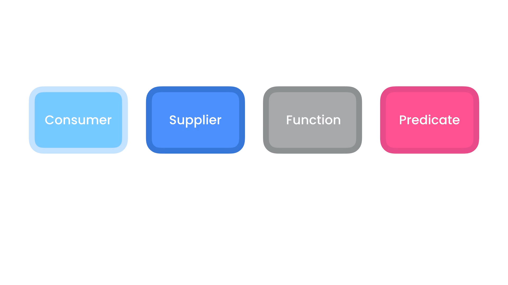

# Lambda Expressoin:
- [Lambda Expressoin:](#lambda-expressoin)
  - [Functional Interfaces:](#functional-interfaces)
  - [Anonymous Classes:](#anonymous-classes)
  - [Lambda Expression:](#lambda-expression)
  - [Variable Capture:](#variable-capture)
  - [Method References:](#method-references)
  - [Functional Built-In:](#functional-built-in)
  - [Consumer Interface:](#consumer-interface)
  - [Supplier Interface:](#supplier-interface)
  - [Function Interface](#function-interface)
  - [Predicate Interface:](#predicate-interface)
  - [Binary Operator:](#binary-operator)
  - [Unary Operator:](#unary-operator)

`packageName: java.utils.function`
## Functional Interfaces:

`Functional Interfaces`: are interfaces that have a single abstract method(doesn't have an implementation in the Interface).

**Exemple**:
```java
package com.app.lambdas;

Interface Printer{
    void print(String message);
    default String defaultMethod(){
        //Instructions
    
}
```
## Anonymous Classes:

Anonymous Classes are classes that are created inside another class without a name like :
```java
greet(new Printer(){
    @Override
    public void print(String message){
        System.out.print(message);
    }
});
//greet is a method that takes as argument a Printer object, so we created a direct class who implement Printer
```

## Lambda Expression:

**Example**:
```java
greet((String message) -> {
    System.out.print(message);
});
// greet function takes in argument a Printer implementation which a functional interface, it has one method to be overrided, and it's the same method we declare using lambda expression
greet(message -> System.out.print(message));
// we can skip type declaring, because java compiler directly understand that we are impelemting the print function from Printer, and it knows its signature

Printer printer = message -> System.out.print(message);
greet(printer);
// we can store lambda expression in a variable 
```
## Variable Capture:

When using Lambda function, we still access to variable inside the method we use the expression in, or even class fields.

## Method References:

When having functional interface, and we are using a method that take it as argument, like in the example below, we can pass just a reference for the method

**Syntaxe**:
```java
method(Object::Method);
```

**Example**:
```java
package com.app.lambdas;

public class LambdasDemo {

    public LambdasDemo(){

    }

    public LambdasDemo(String message){
        System.out.println(message);
    }

    public static void print(String message){
        System.out.println(message);

    }
    public void nonStaticPrint(String message){
        System.out.println(message);
    }

    public static void show(){
        //var consolePrinter = new ConsolePrinter();
        var labmda = new LambdasDemo();
        greet(System.out::println);
        greet(LambdasDemo::print);
        greet(labmda::nonStaticPrint);
        greet(LambdasDemo::new);

    }
    public static void greet(Printer printer){
        printer.print("hello world");

    }


    
}
```
## Functional Built-In:

<div style="display:flex;justify-content:center;align-item:center">

</div>

- Consumer : take inputs, no outputs
- Supplier : no inputs, give outputs
- Function : map inputs to outputs
- Predictable : takes inputs, return boolean

## Consumer Interface:

Consumer interface has two mains methods, `addThen` for chaining, `accept` method, you can check the documentation for more information

**Methods**:
```java
// Source code is decompiled from a .class file using FernFlower decompiler.
package java.util.function;

import java.util.Objects;

@FunctionalInterface
public interface Consumer<T> {
   void accept(T var1);

   default Consumer<T> andThen(Consumer<? super T> after) {
      Objects.requireNonNull(after);
      return (t) -> {
         this.accept(t);
         after.accept(t);
      };
   }
}
```

some methods takes this interface as an argument, which allow us to code in a declarative way, rather than imperative.

**Example**:
```java
List<Integer> numbers = List.of(1,3,5,6);
// Imperative programming
for(var item : numbers){
    System.out.print(item);
}
// Declarative programming
numbers.forEach(item -> System.out.print(item));
```

related interfaces: BiConsumer, IntConsumer.


**Chaining Consumer**:

**Example**:
```java
List<String> alphas = List.of("a", "b", "c", "d", "e");

Consumer<String> print = item -> System.out.print(item);
// originally it's 
// Consumer<String> print = (String item) -> System.out.print(item);
Consumer<String> printUpperCase = item -> System.out.print(item.toUpperCase());
alphas.forEach(print.andThen(printUpperCase));
```
## Supplier Interface:
Takes nothing, and does return a value.

```java
// Source code is decompiled from a .class file using FernFlower decompiler.
package java.util.function;

@FunctionalInterface
public interface Supplier<T> {
   T get();
}

```

**Example**:
```java
Supplier<Double> getRandom = () -> {return Math.random();};
//               getRandom = () -> Math.random();
System.out.println(getRandom.get());
``` 
we can use DoubleSupplier to handle double values without having the cost of autoboxing, we can do the same with all primitive values(BooleanSupplier....).

## Function Interface 
it takes an argument and return a value

```java
// Source code is decompiled from a .class file using FernFlower decompiler.
package java.util.function;

import java.util.Objects;

@FunctionalInterface
public interface Function<T, R> {
   R apply(T var1);

   default <V> Function<V, R> compose(Function<? super V, ? extends T> before) {
      Objects.requireNonNull(before);
      return (v) -> {
         return this.apply(before.apply(v));
      };
   }

   default <V> Function<T, V> andThen(Function<? super R, ? extends V> after) {
      Objects.requireNonNull(after);
      return (t) -> {
         return after.apply(this.apply(t));
      };
   }

   static <T> Function<T, T> identity() {
      return (t) -> {
         return t;
      };
   }
}
```

**Example**
```java
Function<String,Integer> map = str -> str.length();
String word = "word";
int length = map.apply(word);
System.out.println(length);
```
Related interfaces: IntFunction, DoubleFunction, IntToLongFunction (check the documentation for more informations)

**Composing Functions**:

```java

//tr "key:value" -> {"key=value"}
Function<String, String> replaceColonn = str -> str.replace(":","=");
Function<String, String> addBraces = str -> "{" + str + "}";

String firstResult = replaceColonn.andThen(addBraces).apply("key:value");
String secondResult = addBraces.compose(replaceColonn).apply("key:value");

System.out.println(firstResult); // {"key=value"}
System.out.println(secondResult); // {"key=value"}

```
## Predicate Interface:
It takes an argument and return boolean value.

**Declaration**:
```java
// Source code is decompiled from a .class file using FernFlower decompiler.
package java.util.function;

import java.util.Objects;

@FunctionalInterface
public interface Predicate<T> {
   boolean test(T var1);

   default Predicate<T> and(Predicate<? super T> other) {
      Objects.requireNonNull(other);
      return (t) -> {
         return this.test(t) && other.test(t);
      };
   }

   default Predicate<T> negate() {
      return (t) -> {
         return !this.test(t);
      };
   }

   default Predicate<T> or(Predicate<? super T> other) {
      Objects.requireNonNull(other);
      return (t) -> {
         return this.test(t) || other.test(t);
      };
   }

   static <T> Predicate<T> isEqual(Object targetRef) {
      return null == targetRef ? Objects::isNull : (object) -> {
         return targetRef.equals(object);
      };
   }

   static <T> Predicate<T> not(Predicate<? super T> target) {
      Objects.requireNonNull(target);
      return target.negate();
   }
}

```
> it has one abstract method `test`.

<br>

**Example**:
```java
package com.app.lambdas;

import java.util.function.Predicate;

public class LambdasDemo {
    public LambdasDemo(){

    }
    public static void show(){

        Predicate<String> isLongerthan5 = str -> str.length() > 5;

        boolean result = isLongerthan5.test("sky");
        System.out.println(result); //false
    }
}
```

**Combining Predicates"**:
```java
Predicate<String> hasLeftBrace = str -> str.startsWith("{");
Predicate<String> hasRightBrace = str -> str.endsWith("}");

boolean resultAnd = hasLeftBrace.and(hasRightBrace).test("{hello}");
boolean resultOr = hasLeftBrace.or(hasRightBrace).test("{hello}");
boolean resultInverse = hasLeftBrace.and(hasRightBrace).negate().test("{hello}");
 

System.out.println(resultAnd);
System.out.println(resultOr);
System.out.println(resultInverse);
```

## Binary Operator:
Takes two argument return one value.
check docs

## Unary Operator:
Takes one arg return one value
check docs