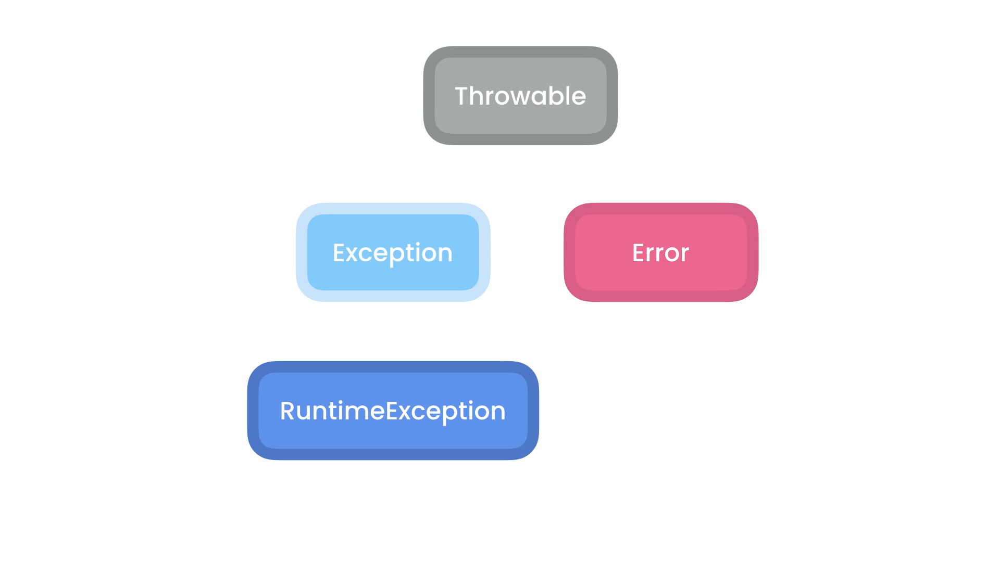

- [Exceptions](#exceptions)
  - [What Are Exceptions:](#what-are-exceptions)
  - [Types of Exceptions:](#types-of-exceptions)
  - [Exceptions Hierarchy:](#exceptions-hierarchy)
  - [Catching Exceptions:](#catching-exceptions)
  - [Catching Multiple Exceptions:](#catching-multiple-exceptions)
  - [The Finally Block:](#the-finally-block)
  - [The Try-With-Resources-Statements:](#the-try-with-resources-statements)
  - [Throwing Exceptions:](#throwing-exceptions)
  - [Re-Throwing Exceptions:](#re-throwing-exceptions)
  - [Custom Exceptions:](#custom-exceptions)
  - [Chaining Exceptions](#chaining-exceptions)

# Exceptions


## What Are Exceptions:
Exception is an event, which occurs during the execution of a program, that disrupts the normal flow of the program's instructions.


`Stack Trace`: when an exception is throwen, it shows the called methods in reverse order.

## Types of Exceptions:
- **Checked Exceptions(Compile time)**: are exceptions that we should handle, like reading data from a file etc...
- **Unchecked Exceptions(Run time)**: are exceptions that we don't need to handle them, because they are came from programming mistakes.
    Examples: 
        - NullPointerException
        - ArithmeticException
        - IllegalArgumentException
        - IndexOutOfBoundException
        - IllegalStateException
- **Errors**: are exceptions related to ressources or jvm itself, we can't not handle it at all, like `StackOverFlow`.
  
## Exceptions Hierarchy:



## Catching Exceptions:

**Syntaxe:**
```java
package com.app.exceptions;

import java.io.FileReader;
import java.io.IOException;

public class ExceptionsDemo {

    public static void show(String message) {
        try (var reader = new FileReader("file.txt")) {
        } catch (IOException e) {
            System.out.println(e.getMessage());
            e.printStackTrace();
        }

        System.out.println("out of block");

    }
    //or we can use for try instead of try(instruction)
    try{
        //INSTRUCTION
    }
    /*
        The difference between the two implementation, is in the first reader object is gonna automatically closed after finishing the block.
        where the second we should close reader manually, by creating a null object, and affect it inside try, closing it using finally clausure 
    */

}
```

## Catching Multiple Exceptions: 

```java
package com.app.exceptions;

import java.io.FileNotFoundException;
import java.io.FileReader;
import java.io.IOException;
import java.text.ParseException;
import java.text.SimpleDateFormat;

public class ExceptionsDemo {

    public static void show(String message) {
        try (var reader = new FileReader("text.txt")) {
            new SimpleDateFormat().parse(null);
        } catch (FileNotFoundException e) {
            System.out.println(e.getMessage());
            e.printStackTrace();

        } catch (ParseException e) {
            e.printStackTrace();
        } catch (IOException e) {
            e.printStackTrace();

        }
        System.out.println("out of block");

    }

} 
// or
        try (var reader = new FileReader("text.txt")) {
            new SimpleDateFormat().parse(null);
        } catch (FileNotFoundException e) {
            System.out.println(e.getMessage());
            e.printStackTrace();

        } catch (ParseException | IOException e) {
            e.printStackTrace();
        }
        System.out.println("out of block");
    
```

## The Finally Block: 
finally block is a block that's gonna run in both case try and catch.

```java
    public static void show(String message) {
        FileReader reader = null;
        try {
            reader = new FileReader("text.txt");
            new SimpleDateFormat().parse(null);
        } catch (FileNotFoundException e) {
            System.out.println(e.getMessage());
            e.printStackTrace();

        } catch (ParseException | IOException e) {
            e.printStackTrace();
        } finally {
            if (reader != null) {
                try {
                    reader.close();
                } catch (IOException e) {
                    e.printStackTrace();
                }
            }

        }
        System.out.println("out of block");

    }
```
## The Try-With-Resources-Statements:

instead of using finally block we can use try-with-ressources-statements, it can be done just for class that implement Closable interface.

```java
    public static void show(String message) {
        try(
            var reader = new FileReader("text.txt");
            var writer = new FileWriter("text.txt");
        ) {
            
            new SimpleDateFormat().parse(null);
        } catch (FileNotFoundException e) {
            System.out.println(e.getMessage());
            e.printStackTrace();

        } catch (ParseException | IOException e) {
            e.printStackTrace();
        }
        System.out.println("out of block");

    }
```
## Throwing Exceptions:

defensive programming: is a technique used in software development to identify and handle problem situations in order to prevent software failures.

**Syntaxe**(Unchecked Exception):
```java
//Account.java
package com.app.exceptions;

public class Account {
    public static void deposite(float value) {
        if (value < 0)
            throw new IllegalArgumentException();
    }

}

//Main
account.deposite(-1) // this is gonna throw an error
//as illegar arugment exception is a runtime exception we don't need to handle 
```
**Syntaxe**(checked Exception):
```java
//Account.java
package com.app.exceptions;

import java.io.IOException;

public class Account {
    public void deposite(float value) throws IOException {
        if (value < 0)
            throw new IOException();
    }

}
//Main.java
        var account = new Account();

        try {
            account.deposite(-1);
        } catch (IOException e) {
            e.printStackTrace();
        }

    }
```

## Re-Throwing Exceptions:
Sometimes we throw an exception inside a method of a class and handle it there, but the application in the main keep functioning, which may cause a problem.
Example:
```java
//ExceptionsDemo.java
package com.app.exceptions;

import java.io.IOException;

public class ExceptionsDemo {

    public static void show(String message) throws IOException {
        var account = new Account();

        try {
            account.deposite(-1);
        } catch (IOException e) {
            System.out.println("Logging");
            throw e; //here we re-throw the exception to handle in the top next class
        }

    }
}
```
```java
//main.java
package com.app;

import java.io.IOException;

import com.app.exceptions.ExceptionsDemo;

public class Main {
    public static void main(String[] args) {
        try {
            ExceptionsDemo.show(null);
        } catch (IOException e) {
            e.printStackTrace();
        }

    }
}
```

## Custom Exceptions:
We can create our custom exceptions following this syntaxe 
```java

public class NameException extends Exception {
    public NameException(){
        super("message");

    }

    public NameException(String message){
        super(message);

    }
}
// in this example we've created a checked exception to create an unchecked exception we should extend RunTimeException
```

## Chaining Exceptions
An Exception cause another exception.

**Syntaxe**:
```java
var wrapperException = new WrapperException();
var childException = new ChildException();
wrapperException.initCause(childException);
throw wrapperException();

// or 
// add to construction of WrapperException

public class WrapperException extends Exception {
    public WrapperException(Exception cause){
        super(cause);

    }
}

// then
throw new WrapperException(new ChildException());
//in catch method we can access the cause exception(child) by using getCause method.
```

    


